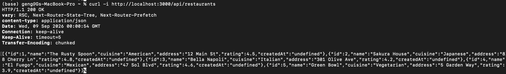
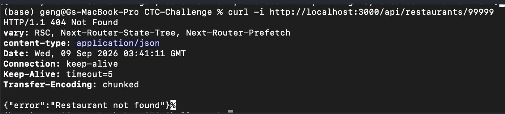
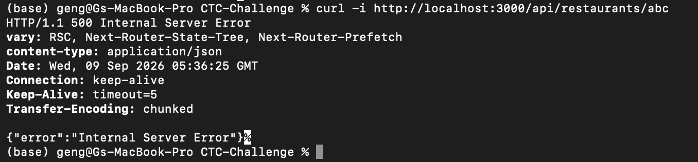
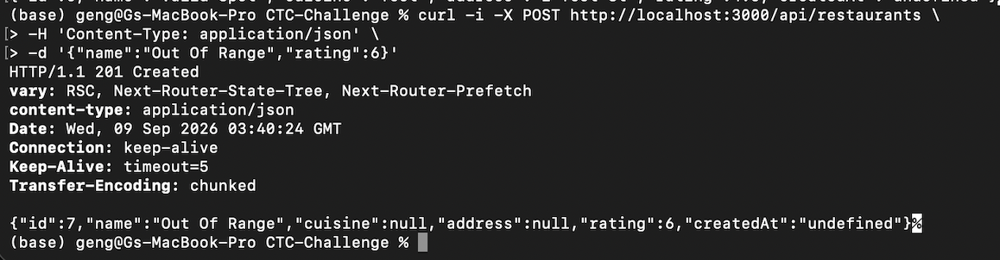

# Write-up

> This is the skeleton - replace everything in blockquotes with your own words
> and delete the prompts as you go. Aim for **~300 words** across the four
> questions; the route reference below can be as long as it needs to be.
>
> Write it like you're handing the work to a teammate. We'd rather read an
> honest "I ran out of time on X and here's what I'd do" than a polished list of
> accomplishments. **Submit this even if you didn't finish** - see CHALLENGE.md.

## 1. What did you build for Part B, and why that?

> For Part B, I decided to focus on the UI. Since I am new to using Next.js, I spent a lot of time learning how things worked > leaving me little time to focus on Part B. Since I had such a small amount of time, I decided to focus on learning how to > > build a button/toggle function since they are one of the most used functions in applications.

## 2. What did you decide, and what did you rule out?

> I decided to focus on UI since that was what I felt most comfortable with. I deliberately did not choose route shapes since > I am unfamiliar with them and it would take a some time to learn them.  

## 3. Where did you cut corners?

> With more time, I would have kept the address and cuisine showing, and would have the visit information appear upon 
> expansion. I decided to make the address and cuisine show upon expansion to that it functions since I did not have enough 
> time to make a route for the visit information. 

---

## Part B: routes

## Schema changes

> none

## How I verified this

> How you checked your work - the happy paths _and_ the failures. `curl`
> commands, a Postman collection, a scratch script, screenshots: whatever you
> actually used. Paste the commands.
>
> This is much faster for us to review than working it out ourselves, and it's
> how you show you checked the edge cases.

**Part A** - the contract table in CHALLENGE.md, every row including the error
cases:

```bash
# e.g.
curl -i http://localhost:3000/api/restaurants          # 200 + array


curl -i http://localhost:3000/api/restaurants/99999    # 404


curl -i http://localhost:3000/api/restaurants/abc      # 404


curl -i -X POST http://localhost:3000/api/restaurants \
  -H 'Content-Type: application/json' \
  -d '{"name":"Out Of Range","rating":6}'              # 400

```

**Part B** - the equivalent cases for what you built:

```bash

```

## Known issues / what I'd do next

> I did not finish Part A3. With more time I would like to finish it. Since Next.js is new to me, I took a lot of time learning about it and undertand routes, front-end and back-end. I focused on building a strong A1, A2, and attempting Part B. 
